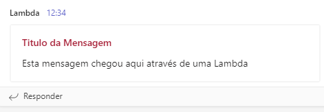
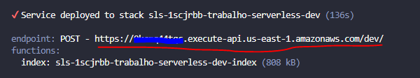
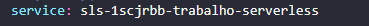
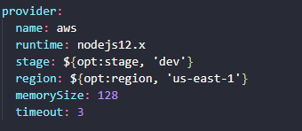
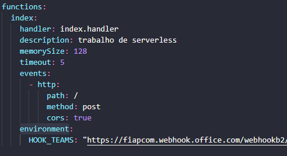

# Trabalho Serverless

Para desenvolvimento deste projeto foi utilizada a seguinte stack:

- framework : [serverless.com](https://www.serverless.com/)
- linguagem: node(javascript)

## Funcionalidade da aplicação

A aplicação consiste em uma função lambda que ao receber uma requisição HTTP (POST) envia uma notificação no MSTeams utilizado [AdaptativeCard](https://adaptivecards.io/).

Esta mensagem consiste em um título e um corpo ambos em texto.

Para enviar a mensgem necessário executar o seguinte POST (Alterar a URL pela fornecida no passo 5 da sessão Executando o Projeto):

`curl --request POST \
  --url <URL PASSO_5_DA _SESSAO_EXECUTANDO_ O _PROJETO> \
  --header 'Content-Type: application/json' \
  --data '{
	"titulo": "Titulo da Mensagem",
	"mensagem": "Esta mensagem chegou aqui através de uma Lambda"
}'`

## Executando o projeto

1. Configurar as credencias de usuário do IAM da AWS

   [https://www.serverless.com/framework/docs/providers/aws/guide/credentials](https://www.serverless.com/framework/docs/providers/aws/guide/credentials)

2. Clonar o repositório

   `git clone https://github.com/psantanna1990/1SCJRBB_serverless.git`

3. Instalar as dependencias

   `npm install`

4. Fazer o deploy

   `serverless deploy`

5. Copiar o endpoint informado no final da execução do comando anterior

   

## Desprovisionamento do ambiente

Para desprovisionar o ambiente executar o comando:

    `serverless remove`

## Estrutura do Projeto

O projeto possui os arquivos padrões de uma aplicação Node, porém para a execução do framework tem que se atentar principalmente a dois arquivos [serverless.yml](./serverless.yml) e o [index.js](./index.js)

### index.js

Possui a lógica da aplicação, a função **handler** que é chamada para a execução da Lambda.

### serverless.yaml

Arquivo de configuração do framework.

1.  Na seção service defino o nome do meu projeto

    

2.  Na seção provider declaramos qual o provedor que utilizaremos podendo ser AWS, Azure ou outros. [Lista de Providres](https://www.serverless.com/framework/docs/providers).

    Declaramos a runtime no nossa caso nodejs12.x e algumas outras opções

    

3.  Na seção functions declaramos as nossa funções no caso possuimos a index

    handler: qual a função que chmaremos
    memorySize: memória que nossa função poderá utilizar
    timeout: tempo de timeout da minha função
    events: aqui colocamos os eventos que podemos utilizar nesse caso está configurado o API GAteway
    environment: variáveis de ambiente declarado de igual em um "docker-compose"

    

## Equipe

- Carlos Mateus Borges Junior - RM344974
- Daniel de Oliveira Carvalho - RM344795
- Pedro Sant Anna Lima Oliveira - RM344804
- Willian Prestes Correia Cellos - RM344812
